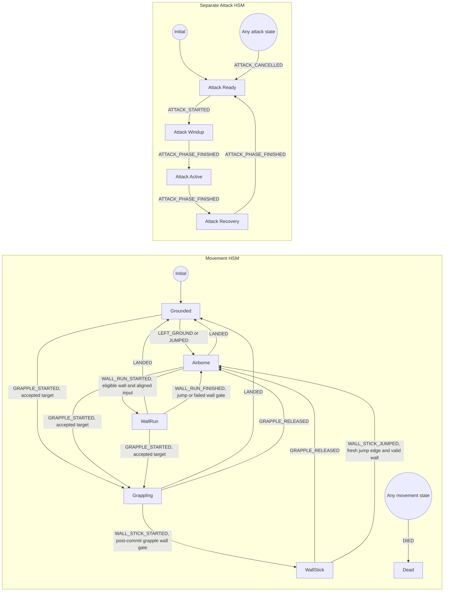
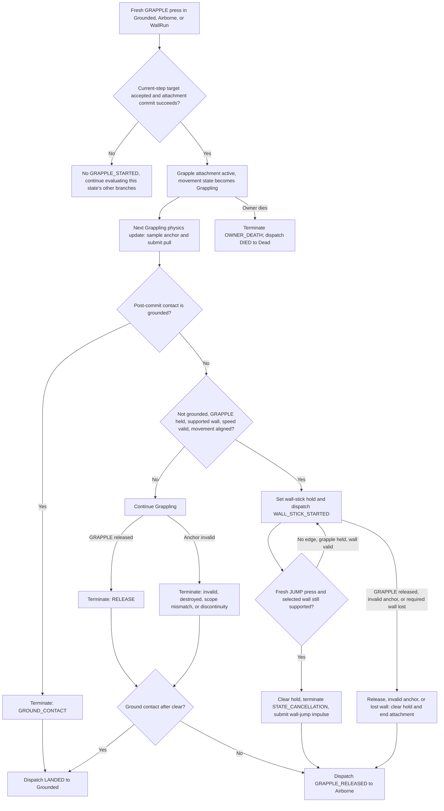
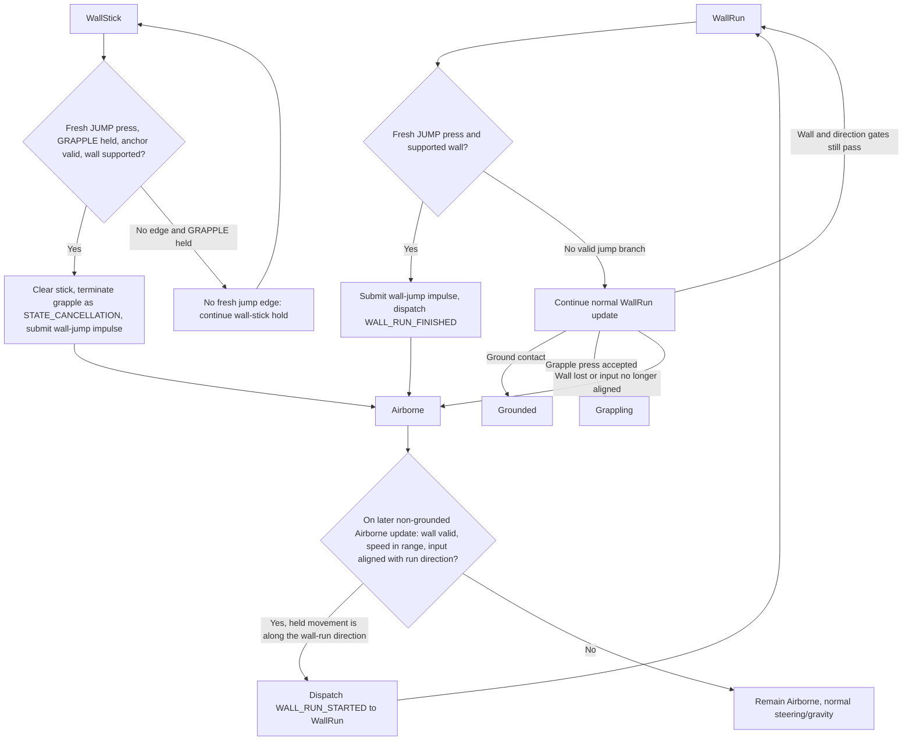

# Investigation: Movement and Grappling State Flow

## Hand-off Brief

1. **What happened.** The user requested a movement/grapple transition diagram and identified grounded-grapple cancellation plus a wall-jump/wall-stick behavior they want explained.
2. **Where the case stands.** The registered state graph, grounded grapple terminal, wall-stick jump exit, and conditional wall-run re-entry are source-confirmed; the exact input sequence behind the reported wall-stick continuation is not yet known.
3. **What's needed next.** Confirm whether the held “wall-run/stick key” means movement direction, the grapple action, or both if the user wants the second behavior reproduced exactly.

## Case Info

| Field            | Value |
| ---------------- | ----- |
| Ticket           | N/A |
| Date opened      | 2026-09-27 |
| Status           | Active — source-grounded diagram complete; one runtime reproduction detail remains open |
| System           | Windows; Godot 4.7.2-stable; GrappleGame project |
| Evidence sources | Godot AI MCP live editor/session; `res://scenes/player.tscn`; `scripts/player_controller.gd`; repository source search |

## Problem Statement

User-reported request: “For the movement and grappling I need to understand the various transitions and states - make me a diagram that covers all diagrams and transition states”. Follow-up reports: “when grappling while grounded the grapple immediately gets cancelled, while jumping off a wall if the wall run / stick key (towards the wall or direction of movement) is held then the jump immediately gets cancelled and the wall-stick continues”. These observations guide the diagram, but the wall-jump observation is not yet reproduced or matched to one specific input sequence.

## Evidence Inventory

| Source | Status | Notes |
| ------ | ------ | ----- |
| Godot AI MCP session/editor state | Available | Active session `grapplegame@158d53ec546cd5b1`; editor/game report a live run of `res://main.tscn` during follow-up. |
| Godot AI MCP scene hierarchy and scene resource | Available | Inspected `res://scenes/player.tscn`; confirms MovementHSM state nodes and an independent AttackHSM. |
| Godot AI MCP script outline | Available | `res://scripts/player_controller.gd`; reports state initialization, physics frame, grapple, wall traversal, and death handlers. |
| Player controller source | Available | Transition registrations observed at `scripts/player_controller.gd:280-309`. |
| Movement/grapple state implementations | Available | Grounded, airborne, grappling, wall-run, and wall-stick state paths plus controller event producers inspected. |
| Tests | Available (not run in this task) | Existing integration assertions cover grapple termination on grounded contact and successful wall-run/wall-stick jump exits. |
| Version history | Available | Recent player traversal change is commit `332eddf` (“implemented story 1.9”). |
| Current runtime snapshot | Available, not a reproduction | Read-only MCP snapshot showed the player grounded with grappling, wall-running, and wall-sticking all false; no input was simulated. |
| Editor diagnostics | Available | MCP returned 12 current entries: two engine resource/autoload load errors and script warnings; relevance to these transitions is unconfirmed. |
| Issue tracker | Missing | No issue-tracker connector or ticket was provided. |
| Static-analysis results | Missing | No separate static-analysis run was performed. |

## Investigation Backlog

| # | Path to Explore | Priority | Status | Notes |
| - | --------------- | -------- | ------ | ----- |
| 1 | Movement state scripts and locomotion event dispatch | High | Done | State guards, transition events, and post-commit event sources traced. |
| 2 | Grapple targeting, activation, attachment, termination, and post-clear routing | High | Done | Ground-contact terminal and wall-stick lifecycle traced. |
| 3 | Player input, physics command/motor pipeline, and wall contact handling | High | Done | Per-physics-step order and movement-axis gates traced. |
| 4 | Tests and story artifacts for movement/grapple transition acceptance | Medium | Done | Relevant existing test assertions inspected; tests were not executed. |
| 5 | Attack HSM interaction with movement/grapple states | Medium | Done | It is separately registered; no cross-machine movement transition was found in the traced paths. |
| 6 | Add complete Mermaid diagram with transition labels and evidence | High | Done | Three diagrams and behavior notes are included below. |
| 7 | Identify the exact held input in the reported wall-jump scenario | Medium | Open | Needed to distinguish a fresh jump edge, a held movement direction, and a simultaneous grapple press. |

## Timeline of Events

| Time | Event | Source | Confidence |
| ---- | ----- | ------ | ---------- |
| 2026-09-27 | Connected Godot AI MCP session identified; project editor reports the player scene is open and the game is live. | MCP session list and editor state | Confirmed |
| 2026-09-27 | Current player scene hierarchy and serialized scene inspected; movement and attack HSM nodes are present. | MCP `scene_get_hierarchy`; MCP `filesystem_manage(read_text)` on `res://scenes/player.tscn` | Confirmed |
| 2026-09-27 | Controller declares the movement transitions and a separate attack transition set. | `scripts/player_controller.gd:280-309` | Confirmed |
| 2026-09-27 | User identifies grounded grapple cancellation and a wall-jump input scenario where wall-stick appears to continue. | User report | Confirmed as reported behavior; not yet reproduced |
| 2026-09-27 | Source and integration test confirm an active grapple is terminated with `GROUND_CONTACT` when its committed contact frame remains grounded, then routed through `LANDED`. | `scripts/player_controller.gd:425-431`; `tests/player/motor/test_player_motor_integration.gd:288-334` | Confirmed |
| 2026-09-27 | Wall-run jump routes to Airborne; Airborne can later re-enter WallRun when the supported-wall, speed, and movement-direction gates pass. | `scripts/player_wall_run_state.gd:28-35`; `scripts/player_airborne_state.gd:26-32`; `scripts/player_controller.gd:876-984` | Confirmed transition logic; occurrence in user's scenario deduced |
| 2026-09-27 | A valid wall-stick jump clears the stick, ends the grapple with `STATE_CANCELLATION`, and dispatches `WALL_STICK_JUMPED` to Airborne. | `scripts/player_controller.gd:742-755`; `scripts/player_wall_stick_state.gd:48-54`; `tests/player/locomotion/test_wall_traversal_integration.gd:333-346` | Confirmed |

## Confirmed Findings

### Finding 1: The live player scene has separate movement and attack HSMs

**Evidence:** Godot AI MCP session `grapplegame@158d53ec546cd5b1`; `res://scenes/player.tscn` inspected via MCP; active hierarchy includes `/Player/MovementHSM` and `/Player/AttackHSM` with their respective state nodes.

**Detail:** Movement HSM nodes are `GroundedState`, `AirborneState`, `GrapplingState`, `WallRunState`, `WallStickState`, and `DeadState`. The attack HSM nodes are `AttackReadyState`, `AttackWindupState`, `AttackActiveState`, and `AttackRecoveryState`. The HSMs are separate, but the player death handler dispatches terminal/cancel events to both.

### Finding 2: The movement transition graph is explicitly registered in the player controller

**Evidence:** `scripts/player_controller.gd:280-298`.

**Detail:** Registered transitions are:

- Grounded → Airborne: `EVENT_LEFT_GROUND` or `EVENT_JUMPED`
- Grounded → Grappling: `EVENT_GRAPPLE_STARTED`
- Airborne → Grounded: `EVENT_LANDED`
- Airborne → Grappling: `EVENT_GRAPPLE_STARTED`
- Airborne → WallRun: `EVENT_WALL_RUN_STARTED`
- Grappling → Grounded: `EVENT_LANDED`
- Grappling → Airborne: `EVENT_GRAPPLE_RELEASED`
- Grappling → WallStick: `EVENT_WALL_STICK_STARTED`
- WallRun → Grounded: `EVENT_LANDED`
- WallRun → Airborne: `EVENT_WALL_RUN_FINISHED`
- WallRun → Grappling: `EVENT_GRAPPLE_STARTED`
- WallStick → Airborne: `EVENT_GRAPPLE_RELEASED` or `EVENT_WALL_STICK_JUMPED`
- Any movement state → Dead: `EVENT_DIED`

The controller initializes and activates the movement HSM, then disables its built-in process and physics-process callbacks (`scripts/player_controller.gd:296-299`); the controller drives `movement_hsm.update(delta)` inside its own physics transaction (`scripts/player_controller.gd:312-377`).

### Finding 3: The attack state graph is separately registered

**Evidence:** `scripts/player_controller.gd:301-309`.

**Detail:** AttackReady → AttackWindup → AttackActive → AttackRecovery → AttackReady uses `EVENT_ATTACK_STARTED` and `EVENT_ATTACK_PHASE_FINISHED`; `EVENT_ATTACK_CANCELLED` routes any attack state to AttackReady.

### Finding 4: Ground contact explicitly terminates a grapple and returns locomotion to Grounded

**Evidence:** `scripts/player_controller.gd:402-431`; `tests/player/motor/test_player_motor_integration.gd:288-334`.

**Detail:** After a Grappling-state physics step is committed, `_coordinate_post_commit()` checks the resulting contact frame. If it is grounded, it terminates the active attachment with `GrappleEndReason.Reason.GROUND_CONTACT`, then dispatches `EVENT_LANDED` (unless a locomotion event is already pending). The existing integration test keeps the grapple action held, asserts a grounded contact frame, verifies `is_grappling == false`, and checks the committed terminal reason is `GROUND_CONTACT`. A release edge can also end the grapple, but is a separate reason/path.

### Finding 5: Wall-stick is grapple-assisted; a valid jump exits it rather than continuing the hold

**Evidence:** `scripts/player_controller.gd:995-1021`; `scripts/player_wall_stick_state.gd:16-54`; `scripts/player_controller.gd:742-755`; `tests/player/locomotion/test_wall_traversal_integration.gd:333-346`.

**Detail:** Wall-stick is entered after a grapple motion commit, only while an attachment is active and `GRAPPLE` is held, on a supported non-grounded wall with an acceptable speed and movement input aligned to the run direction. A fresh jump press, while the attachment and selected wall remain valid, submits the wall-jump impulse, clears `is_wall_sticking`, terminates the attachment as `STATE_CANCELLATION`, and dispatches `EVENT_WALL_STICK_JUMPED` to Airborne. The integration test asserts the Airborne exit, no remaining hold request, and one terminal. The action enum has Jump, Grapple, and Attack; there is no separate wall-run or wall-stick action (`game/player/input/player_command_frame.gd:5-10`).

### Finding 6: A wall-run jump can be followed by conditional WallRun re-entry, but not direct Airborne-to-WallStick

**Evidence:** `scripts/player_wall_run_state.gd:22-45`; `scripts/player_airborne_state.gd:16-34`; `scripts/player_controller.gd:876-984,995-1021`; `scripts/player_controller.gd:280-295`.

**Detail:** A valid jump edge in WallRun dispatches `EVENT_WALL_RUN_FINISHED` and transitions to Airborne. On subsequent Airborne updates, the same movement-direction input is checked against the supported wall and speed gates; if still eligible and aligned with `wall_run_direction`, the controller sets wall-running true and the state dispatches `EVENT_WALL_RUN_STARTED`, returning to WallRun. There is no registered Airborne → WallStick edge; WallStick entry is a post-commit Grappling-only route. A true WallStick jump requires a fresh `was_pressed(JUMP)` edge; if the edge was consumed before entering WallStick, a held jump alone does not satisfy that check.

## Deduced Conclusions

### Deduction 1: A useful “all transitions” diagram must distinguish parallel state machines

**Based on:** Confirmed Findings 1 and 3.

**Reasoning:** The scene contains distinct movement and attack HSMs, and the controller registers distinct event sets for each.

**Conclusion:** The final artifact should use separate subgraphs (or equivalent lanes) and only draw cross-machine links when source confirms coupling.

### Deduction 2: The grounded grapple symptom is an explicit ground-contact policy, not an unexplained target rejection

**Based on:** Confirmed Finding 4 and the test's successful attachment before the grounded post-commit terminal.

**Reasoning:** The grapple is active during a Grappling-state commit, but the resulting contact frame is grounded; the controller records `GROUND_CONTACT` and routes through `LANDED`.

**Conclusion:** Diagram this as an attachment terminal after a committed Grappling step. Distinguish it from a rejected grapple target or a `RELEASE` terminal.

### Deduction 3: The wall-jump report is consistent with either WallRun re-entry or a jump edge consumed before WallStick

**Based on:** Confirmed Findings 5 and 6; `WallRunState` checks grapple activation before jump; `PlayerCommandFrame` distinguishes edge from held state.

**Reasoning:** A valid WallStick jump clears the hold and transitions to Airborne; WallRun can be entered again from Airborne under its gates. Separately, if grapple activation returns first in a state update, a simultaneous jump edge is not reconsidered on the next frame.

**Conclusion:** The source does not prove that WallStick continues after a valid jump edge. The exact input order and resulting state need a runtime trace to distinguish the explanations.

## Hypothesized Paths

### Hypothesis 1: Grapple has lifecycle states beyond the movement HSM's `GrapplingState`

**Status:** Confirmed

**Theory:** Target acquisition/rejection, attachment creation, active pulling, and teardown may be represented by controller/attachment lifecycle state rather than additional movement HSM states.

**Supporting indicators:** The controller outline includes `try_start_grapple`, `has_valid_grapple`, attachment access/diagnostics, and `terminate_grapple`; the scene includes a grapple target marker and grapple telemetry.

**Would confirm:** Trace `try_start_grapple`, the grapple controller/attachment APIs, `GrapplingState`, and attachment-ended callback.

**Would refute:** Source shows all grapple lifecycle phases are represented only by the six-state movement HSM. This is refuted by the traced targeting/controller/attachment lifecycle.

**Resolution:** Confirmed: target evaluation/activation is performed by the controller, an occurrence-local attachment records terminal state, and movement uses a separate six-state HSM. Ground-contact termination is explicitly exercised by the player motor integration test.

### Hypothesis 2: The reported “wall-stick continues” after a wall-run jump may be WallRun re-entry or a jump edge that was not observed

**Status:** Open

**Theory:** If the player begins in WallRun, a valid fresh jump press exits to Airborne. Held movement aligned with the wall-run direction can satisfy the Airborne state's wall-run entry gate on a later update, making the jump look cancelled even though the state has re-entered WallRun, not WallStick. Alternatively, a jump press can be consumed by a higher-priority grapple-start branch before WallStick becomes active; a held button is not a fresh `was_pressed(JUMP)` edge when WallStick checks it.

**Supporting indicators:** WallRun checks a grapple press before jump (`scripts/player_wall_run_state.gd:22-35`); the Airborne state re-evaluates wall-run eligibility (`scripts/player_airborne_state.gd:26-32`); wall-stick jump checks `was_pressed(JUMP)` (`scripts/player_wall_stick_state.gd:48-54`). The action frame distinguishes pressed, held, and released flags (`game/player/input/player_command_frame.gd:63-72`).

**Would confirm:** A per-physics-step trace of the starting HSM state, `was_pressed(JUMP)`, `was_pressed/is_held(GRAPPLE)`, movement axis, contact frame, active HSM state, `is_wall_running`, `is_wall_sticking`, and terminal reason during the exact input sequence.

**Would refute:** Reproduction shows `WallStickState` receives a fresh valid jump edge and supported wall, but the state fails to exit or `is_wall_sticking` remains true after `submit_wall_stick_jump()`.

**Resolution:** Static code and tests show a valid wall-stick jump exits to Airborne; user-specific runtime sequence remains unverified.

## Missing Evidence

| Gap | Impact | How to Obtain |
| --- | ------ | ------------- |
| Exact input sequence behind the reported wall-jump/wall-stick continuation | Needed to distinguish a movement-direction re-entry from a missed jump edge or a simultaneous grapple start. | Capture one exact reproduction or confirm the held action(s) with the user; inspect per-step state/flags through MCP. |
| Current editor diagnostics context | MCP shows engine resource/autoload errors and script warnings; their cause and relevance are not established. | Inspect only if they obstruct a later runtime reproduction; no source fixes are in scope. |

## Source Code Trace

| Element | Detail |
| ------- | ------ |
| Error origin | N/A — area exploration, no defect reported. |
| Trigger | User requests a movement/grappling state and transition diagram and points out two observed paths. |
| Condition | Player HSM is manually updated per physics frame; a committed grounded contact terminates an active grapple; movement-axis wall eligibility can re-enter WallRun from Airborne. |
| Related files | `scripts/player_controller.gd:312-441,843-846,995-1103,1125-1176,1318-1339`; movement state scripts; `game/player/input/player_command_frame.gd`; player motor and traversal tests. |

## Conclusion

**Confidence:** High for the registered state graph and grounded grapple cancellation; Medium for interpreting the user-reported wall-jump symptom.

The grounded grapple behavior is confirmed by controller source and an existing integration assertion: a grapple still grounded after its motion commit terminates with `GROUND_CONTACT` and returns through `LANDED`. A valid wall-stick jump exits to Airborne and clears both hold and attachment. A wall-run jump also exits to Airborne; held movement that continues to meet wall-run gates can re-enter WallRun on a later update. The source does not support a direct Airborne → WallStick transition, so the user's description of WallStick continuing remains an unverified runtime interpretation until the exact held key/input edge is known.

## Recommended Next Steps

### Fix direction

N/A — documentation/exploration request; no code defect is in scope.

### Diagnostic

No gameplay change is recommended from static evidence alone. If requested, reproduce the wall-jump input sequence with an MCP per-step state/input trace before proposing a behavior change.

## Reproduction Plan

Source-verification plan completed for the diagram. To resolve the remaining user-specific behavior, replay: (1) fresh jump from WallRun while maintaining along-wall movement, (2) fresh jump from WallStick while Grapple remains held, and (3) simultaneous Grapple+Jump press while in WallRun; record the active HSM state and attachment terminal each physics step. These cases were not simulated in the current live session.

## Side Findings

- **Confirmed MCP observation:** editor state was `playing` and game status `live`; no runtime inputs were sent.
- **Confirmed MCP observation:** current editor diagnostics contained 12 entries, including `_load: Resource file not found: res:// (expected type: unknown)`, an autoload-load error for `.`, and script warnings (including shadowed identifiers and an incompatible ternary). Their cause and relevance to this task are unverified.
- **Confirmed MCP observation:** at the read-only runtime snapshot the player was grounded; `is_grappling`, `is_wall_running`, and `is_wall_sticking` were all false. This was not a reproduction of either report.
- **Confirmed repository preservation note:** `project.godot`, `scenes/player.tscn`, and other investigation notes were already modified/untracked in the worktree. They were inspected where relevant and left untouched.

## Godot AI MCP Evidence

| Session ID | Meaningful operations | Results |
| ---------- | -------------------- | ------- |
| `grapplegame@158d53ec546cd5b1` | Initial: `session_manage(list)`, `editor_state`, `logs_read(editor)`, `scene_get_hierarchy`, `filesystem_manage(read_text, res://scenes/player.tscn)`, `script_manage(find_symbols, res://scripts/player_controller.gd)`. Follow-up: MCP reads of grounded/grappling/wall-stick/wall-run/airborne scripts; `api_manage(get_class, LimboHSM)`; `game_manage(get_scene_tree/get_node_info)` including runtime wall-run properties; read-only `editor_manage(game_eval)` of player flags and active/initial HSM states; post-edit `filesystem_manage(read_text)` of this artifact; final `editor_state` and `logs_read(editor)`. | One active Godot 4.7.2 session; editor scene `res://main.tscn`, live runtime root `TreeGrappleTutorial`; player scene/state resources and scripts inspected. One runtime snapshot was grounded with no grapple/wall flags; initial states were Grounded and AttackReady. Runtime wall-run values read: min horizontal 3, max entry 18, input alignment 0.2, target speed 10, acceleration 4, zero vertical true. MCP reread the Markdown artifact. 12 editor diagnostics remained visible. No source/scene mutation or simulated input performed. |

## Follow-up: 2026-09-27

### New Evidence

- User identified two paths of interest: grapple activation while grounded seems to cancel immediately; a wall jump while a wall-run/stick input is held seems to cancel the jump while wall-stick continues.
- Godot AI MCP reads confirmed the live player's current and initial movement state as `GroundedState`, and current/initial attack state as `AttackReadyState`. This was a read-only snapshot, not a reproduction.
- A later read-only MCP inspection of `/TreeGrappleTutorial/Generated/Player` confirmed current wall-run values: minimum horizontal speed `3`, maximum entry speed `18`, minimum input alignment `0.2`, run target speed `10`, acceleration `4`, and vertical velocity reset enabled.
- The live player at the snapshot was grounded with `is_grappling`, `is_wall_running`, and `is_wall_sticking` all false.
- Existing integration tests assert the grounded grapple terminal (`GROUND_CONTACT`) and successful wall-stick jump exit to Airborne. The wall-run jump test asserts the first post-jump state is Airborne; no tests were run as part of this documentation task.
- No separate `WALL_RUN` or `WALL_STICK` action exists in `PlayerCommandFrame.Action`; the code uses `movement_axis` for wall alignment and `GRAPPLE` to sustain wall-stick.

### Additional Findings

- **Confirmed — grounded grapple:** with an active attachment and a grounded post-commit contact frame, the controller terminates with `GROUND_CONTACT` then dispatches `LANDED` to Grounded. Existing test `test_real_player_scene_clears_grapple_before_landing_transition` holds GRAPPLE and asserts this exact route.
- **Confirmed — jump from WallStick:** a fresh jump edge while GRAPPLE remains held and the wall is still supported clears wall-stick, ends the attachment as `STATE_CANCELLATION`, and transitions to Airborne. Existing test `test_wall_stick_jump_uses_the_authored_up_away_and_along_wall_motion` asserts this exit.
- **Confirmed — jump from WallRun:** a valid fresh jump edge dispatches `WALL_RUN_FINISHED` to Airborne. Held movement does not block the jump branch; on later Airborne updates, aligned movement plus valid wall/speed facts can dispatch `WALL_RUN_STARTED` back to WallRun.
- **Confirmed — input priority:** in Grounded and WallRun, the grapple activation branch occurs before jump and returns on success. If both action edges occur together and grapple succeeds, the jump edge is not evaluated in that update. WallStick itself requires a fresh `was_pressed(JUMP)` edge; merely holding an already-pressed jump does not count.
- **Not confirmed:** source has no direct Airborne → WallStick transition. Therefore the reported “wall-stick continues” could be a visual description of WallRun re-entry, a jump edge consumed before entering WallStick, or a different input sequence; current live state was not reproducing it.

### Updated Hypotheses

- Hypothesis 1 is **Confirmed**: ground contact explicitly terminates a live grapple, independent of target validity.
- Hypothesis 2 remains **Open**: user-specific wall-jump sequence may result in WallRun re-entry or a missing/consumed jump edge. Resolve with the exact action timing and an MCP per-step state/input trace.

### Backlog Changes

- Complete the source-grounded movement, grapple, attack, and wall-jump diagrams below.
- Keep only the exact input sequence/runtime reproduction as an open evidence item; no gameplay edit is recommended without that evidence.

### Updated Conclusion

The diagram below reflects every registered movement and attack transition, plus source-verified grapple entry/termination and wall-stick entry/jump behavior. The grounded cancellation is confirmed by source and an existing integration assertion. A valid wall-stick jump exits to Airborne; a wall-run jump may re-enter WallRun on later frames if directional wall-run eligibility remains true. The user's exact second sequence was not reproduced, so “WallStick continues” is not asserted as a confirmed code path.

## Complete Transition Diagrams

The diagrams describe the registered HSM states and source-verified event guards/post-commit branches. They do not claim that the live runtime snapshot reproduced the reported inputs.

### 1. Movement and attack HSMs



Godot AI MCP reported `GroundedState` and `AttackReadyState` as the runtime HSM initial states. Attack is a separate HSM; the player death handler dispatches `EVENT_DIED` to movement and `EVENT_ATTACK_CANCELLED` to attack, but there is no direct attack-to-movement transition. There is no registered Airborne → WallStick transition: WallStick is entered from Grappling after a motion commit.

### 2. Grapple start, grounded cancellation, and wall-stick lifecycle



**Grounded-grapple behavior (confirmed):** even if GRAPPLE remains held, the first physics step actually submitted as Grappling ends the attachment as `GROUND_CONTACT` if its committed contact frame is still grounded, then routes to Grounded. (The successful press frame starts the attachment; the Grappling state's pull runs on its next update.) If GRAPPLE is released first, that is a separate `RELEASE` path. Wall-stick entry is post-commit and requires an active grapple, held GRAPPLE, non-grounded supported wall, speed within its gate, and movement aligned with the derived run direction.

### 3. Wall-jump exits and the “jump cancelled” appearance



**How to read the second report:** A valid jump edge in WallRun is not blocked by held movement direction; it exits to Airborne. On a later non-grounded Airborne update, aligned movement plus valid wall/speed facts can start WallRun again. That could look like an immediately cancelled jump, but it is WallRun re-entry, not WallStick continuation. A movement input aimed away from the wall normal is generally perpendicular to `wall_run_direction`, so it fails the along-wall dot-product gate. Physical outward velocity alone does not forbid WallRun re-entry if the latest contact frame still reports a supported wall and the movement input remains along the wall; if the wall is reported lost, the contact gate rejects it. WallStick itself cannot re-enter from Airborne: it is created only after a Grappling-state commit with a live held grapple, and a valid WallStick jump clears the hold and terminates that attachment. If JUMP and GRAPPLE are both newly pressed during WallRun, the grapple-start branch is checked first and returns; that can consume the jump edge before WallStick later checks for a fresh press. In WallStick, GRAPPLE release/invalidity checks happen before the jump check, so jumping out requires GRAPPLE to remain held. The user's precise held input is still needed to select which path occurred.

**Input note:** `PlayerCommandFrame.Action` contains `JUMP`, `GRAPPLE`, and `ATTACK`, not a dedicated wall-run/stick action. Wall-run and wall-stick eligibility both use `movement_axis` aligned with the derived along-wall run direction; WallStick additionally requires GRAPPLE to remain held. Pressing toward the wall normal is not the wall-direction gate described in these source checks. At the live runtime snapshot, the movement gates were configured for at least 3 m/s horizontal speed, at most 18 m/s total entry speed, and a 0.2 minimum movement/run-direction dot product; wall-run vertical velocity reset was enabled.

### Wall-run input and velocity gates, in plain language

| Gate | What the code checks | What that means while playing |
| ---- | ------------------- | ----------------------------- |
| Wall/contact | Not grounded or grappling. The latest expected `ContactFrame` must have a successful wall probe, report wall contact, not report `wall_contact_lost`, and have `INITIAL`, `PRESERVED`, or `SWITCHED` continuity. | Being near where a wall was is not enough once contact is reported lost. |
| Speed to start/re-enter | When `is_wall_running` is false: horizontal speed `sqrt(vx² + vz²) >= wall_run_min_horizontal_speed`, and full 3D speed `velocity.length() <= wall_run_max_entry_speed`. | Vertical speed counts toward the max-entry cap. Script default minimum horizontal speed is 1 m/s; the live player inspected via MCP currently overrides it to 3 m/s. The max-entry cap is 18 m/s. |
| Directional input | Movement axis must be nonzero. It is transformed through the player's basis and normalized, then `input_direction.dot(wall_run_direction) >= wall_run_min_input_alignment`. | The live threshold is 0.2 (about 78.5° either side of the positive run direction). Input magnitude is not compared here once the axis is nonzero; direction is. Pure input into/away from the wall normal is perpendicular to the wall tangent and normally fails. Opposite along-wall input also fails. |
| Run direction | `wall_normal.cross(Vector3.UP)`, normalized; its sign is flipped to agree with current horizontal velocity. | The accepted direction is along the wall in the player's current travel direction, not either tangent direction arbitrarily. |
| Maintaining an existing run | Contact/relationship and the directional-input gate are still checked. In `_update_wall_run_state`, `_can_start_wall_run()` is called only when `is_wall_running` is false. | Despite the exported setting's comment saying the minimum speed is needed to “start or keep” wall running, the current code applies the speed thresholds to entry/re-entry, not each maintenance frame. |
| Motion after entry | Current live values: target `wall_run_speed` 10 m/s, acceleration 4 m/s², `wall_run_zero_vertical_velocity = true`, gravity scale 0. | These shape the committed motion after entry; they are not the entry gates. The vertical reset can suppress upward velocity once the WallRun state is active. |

The `WallRunState` jump branch is evaluated before the movement-direction maintenance check. So a fresh jump press with a valid wall relationship is not rejected just because movement input is misaligned; the alignment gate matters when maintaining or entering/re-entering WallRun.

#### The dot-product check as an angle

Let `n` be the normalized wall normal, `u = (0, 1, 0)` be world up, and `v_h = (vx, 0, vz)` be horizontal velocity. The code first makes a tangent candidate:

```text
t0 = normalize(n × u)
t  = t0, if dot(t0, v_h) >= 0; otherwise -t0
```

The cross product makes `t0` perpendicular to both the wall normal and world up, so it points along the wall. The sign check picks the tangent that agrees with the player's current horizontal travel. For a wall with normal `(0, 0, 1)`, the candidate is `(-1, 0, 0)`; if the player is travelling in `+X`, the sign flips and the run direction becomes `(+1, 0, 0)`.

The input axis is converted to a world-space horizontal vector and normalized:

```text
i = normalize(player_basis * (movement_axis.x, 0, movement_axis.y))
accept input when dot(i, t) >= 0.2
```

For normalized vectors, `dot(i, t) = cos(theta)`, where `theta` is the angle between input and the chosen run direction. With the current `0.2` threshold, input up to about `78.5°` off the forward tangent still passes. Examples, assuming `t = (+1, 0, 0)`:

| World input direction | Dot with `t` | Result |
| --------------------- | ------------ | ------ |
| Along travel `(+1, 0, 0)` | `1.0` | Pass |
| 60° diagonal `(0.5, 0, 0.866)` | `0.5` | Pass |
| Toward/away wall `(0, 0, ±1)` | `0.0` | Fail |
| Opposite tangent `(-1, 0, 0)` | `-1.0` | Fail |
| 80° off tangent | about `0.174` | Fail |

This is an **input direction** test, not a velocity-direction test. Entry velocity is checked separately by its magnitudes: horizontal speed must meet the minimum, while total speed must stay under the cap. Therefore an outward wall-jump velocity does not by itself fail the tangent-input dot test; re-entry still needs valid wall contact, an eligible speed, and input along the selected tangent. If outward motion has already caused the contact frame to report the wall lost, the contact gate blocks it.
